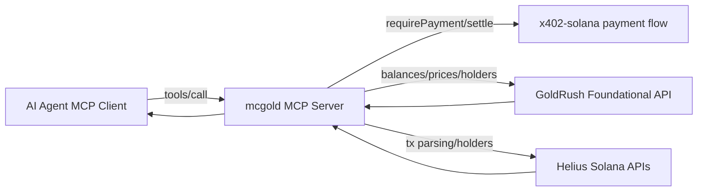

# GoldRush Ecosystem Surveillance Audit

This audit maps GoldRush docs capabilities to `mcgold`'s current implementation, then prioritizes what to add next for feature coverage, cost efficiency, reliability, and go-to-market leverage.

## 1) Capability Inventory (Docs -> Product Clusters)

Source baseline: `https://goldrush.dev/docs/llms.txt` (fetched locally during audit).

### A. Foundational API (REST, historical/near-real-time)
- Key families in docs index: `balances`, `transactions`, `cross-chain`, `nft`, `security`, `utility`, `prices`, `bitcoin`.
- Endpoint role metadata exists (`primary`, `specialized`, `legacy`) and is usable for agent routing policy.
- Credit model is mixed (`per call` and `per item`) and should drive call planning in tools.

### B. Streaming API (GraphQL query/subscription)
- Primary live streams available for:
  - `walletTxs` (wallet activity)
  - `ohlcvCandlesForToken` and `ohlcvCandlesForPair`
  - `newPairs`, `updatePairs`, `updateTokens`
- Query surfaces include `searchToken`, `upnlForToken`, and `upnlForWallet`.
- Strong fit for low-latency monitoring and event-driven AI agents.

### C. x402 API (GoldRush-hosted pay-per-request)
- Base URL: `https://x402.goldrush.dev/v1`.
- Free discovery endpoints:
  - `/v1/x402/endpoints`
  - `/v1/x402/search`
  - `/v1/x402/endpoints/{endpoint}`
- Paid path mirrors 60+ Foundational endpoints.
- Request validation before charge + endpoint-tier pricing (small/medium/large/xl for variable-length endpoints).

### D. Pipeline API (managed delivery into infra)
- Delivery destinations include ClickHouse, Postgres, Kafka, S3/object storage, SQS, webhook.
- Includes Solana normalizers and guides for real-time DEX analytics + PumpFun swap tracking.
- Best suited for production analytics/eventing scale (not required for current MVP, but strategic).

### E. Chain support model
- Support levels documented: `foundational`, `frontier`, `community`, `archived`.
- Docs note foundational parity is strongest on specific chains; this matters for picking robust feature combinations.

---

## 2) Current Integration Map (Code -> User-Visible Outcomes)

## Current dataflow

### A. Where GoldRush is used today
- `src/clients.ts`
  - `GoldRushClient` singleton via `GOLDRUSH_API_KEY`.
- `src/tools/assess-wallet-risk.ts`
  - Uses `BalanceService.getTokenBalancesForWalletAddress` for concentration, long-tail, dust features.
- `src/tools/score-counterparty-trust.ts`
  - Uses `BalanceService.getTokenBalancesForWalletAddress` for stability/concentration features.
- `src/tools/trace-whale-activity.ts`
  - Uses `PricingService.getTokenPrices` for USD notional.
  - Uses `BalanceService.getTokenHoldersV2ForTokenAddress` for holder count cross-check only.
- `src/test-goldrush.ts`
  - Exploratory harness for balances, pricing, historical portfolio, token holders.

### B. Where Helius is used today
- Deep transaction history/parsed movement logic across all three tools.
- Primary holder source in whale analysis due GoldRush Solana holder coverage gaps.

### C. Payment and protocol layer
- `src/payment.ts` uses `x402-solana` protocol flow.
- Payment verification RPC is env-driven (`VENUM_RPC_URL` with devnet fallback).
- Current pay-per-call is project-owned x402 flow (not GoldRush x402 proxy yet).

### D. MCP surface
- `src/mcp-server.ts` exposes exactly 3 paid tools:
  - `assess_wallet_risk`
  - `trace_whale_activity`
  - `score_counterparty_trust`
- Tool outputs are schema-validated in `src/tools/types.ts`.

---

## 3) Coverage Matrix and Gap Prioritization

Scoring dimensions used: impact (product + GTM), effort, reliability lift, credit/cost impact.

| Capability Cluster | Current Status | Gap | Priority | Why |
|---|---|---|---|---|
| Foundational balances | Used | Expand from spot balances into historical portfolio for trend-aware scoring | High | Improves signal quality and differentiates risk/trust outputs |
| Foundational pricing | Partially used | No historical volatility or regime features in production tools | High | High user value for risk narratives, low-medium implementation cost |
| Foundational transactions | Mostly bypassed (Helius dominates) | GoldRush transaction endpoints not used for comparative fallback layer | Medium | Adds redundancy + potential cost/consistency advantages |
| Foundational security (`token_approvals`) | Unused | No approval/spender risk checks in wallet risk tool | High | Clear security signal; strong GTM hook ("allowance risk") |
| Foundational cross-chain (`activity`, `allchains`) | Unused | Solana-only trust/risk context | High | Unlocks "cross-chain trust" narrative and broader market |
| Foundational NFT signals | Unused | No NFT ownership/behavior context | Low-Medium | Optional enrichment; less core to current transfer-risk prompt |
| Streaming wallet activity | Unused | No real-time monitoring mode | High | Enables premium live agent workflows and alerts |
| Streaming OHLCV/new pairs | Unused | No live market/momentum context | Medium-High | Strong for whale monitoring and bot-style use cases |
| GoldRush x402 proxy | Unused | Not using no-key pay-per-request GoldRush path | Medium | Strategic for external agent integrations; medium migration effort |
| Pipeline API destinations | Unused | No managed analytics sink | Medium (strategic) | Best for scale/ops maturity; not immediate MVP need |
| Docs role metadata (`primary/specialized`) | Unused in routing | No endpoint-selection policy in agent logic | High | Reduces hallucination/misrouting and cost |
| Error/rate-limit policy standardization | Partial | Retries/backoff policy is ad-hoc per tool | High | Reliability + predictable latency under load |

---

## 4) Priority Opportunity Backlog (Ranked)

1. Add approval-risk feature to `assess_wallet_risk` using GoldRush `token_approvals`.
2. Add historical portfolio trend features using `getHistoricalPortfolioForWalletAddress`.
3. Add cross-chain exposure signal using `getAddressActivity` (or multichain balances).
4. Add standardized retry/backoff wrapper for GoldRush calls across all tools.
5. Introduce streaming-backed live mode (`walletTxs`) for `trace_whale_activity`.
6. Add volatility-aware pricing features (historical token prices / OHLCV where applicable).
7. Add endpoint-role-aware routing policy (`primary` by default; `specialized` when justified).
8. Evaluate GoldRush x402 proxy path for externalized keyless usage model.

---

## 5) Phased Roadmap (Implementation-Ready)

### Phase 1 (Immediate, highest ROI)
- **P1.1 Approval risk scoring**
  - Files: `src/tools/assess-wallet-risk.ts`, `src/tools/types.ts`, `README.md`
  - Change: add approval-risk subscore + reason text in output.
  - Verify: tool output includes deterministic approval section and non-breaking score bounds.
- **P1.2 Historical portfolio trend factor**
  - Files: `src/tools/assess-wallet-risk.ts`, `src/test-goldrush.ts`
  - Change: use `getHistoricalPortfolioForWalletAddress` to compute stability/trajectory factor.
  - Verify: tests confirm factor behaves for flat vs volatile portfolios.
- **P1.3 Shared GoldRush retry policy**
  - Files: `src/clients.ts` (or new `src/goldrush-retry.ts`), all `src/tools/*.ts`
  - Change: centralized exponential backoff + jitter for 429/500/503.
  - Verify: simulated/transient failures recover with bounded retries and logged attempts.

### Phase 2 (Next, capability expansion)
- **P2.1 Cross-chain trust/risk extension**
  - Files: `src/tools/score-counterparty-trust.ts`, `src/tools/assess-wallet-risk.ts`, `src/tools/types.ts`
  - Change: add optional cross-chain activity overlap and exposure signals.
  - Verify: no regression for Solana-only input; clear feature flags in output.
- **P2.2 Streaming live-monitor mode**
  - Files: `src/tools/trace-whale-activity.ts` (or new streaming companion), `src/mcp-server.ts`
  - Change: add real-time mode backed by streaming subscriptions.
  - Verify: subscription lifecycle, reconnect behavior, and bounded output payloads.
- **P2.3 Endpoint role-aware routing**
  - Files: `src/tools/*`, potentially new `src/goldrush-routing.ts`
  - Change: route defaults to docs `primary`; gate `specialized` by use-case.
  - Verify: route decisions are logged and deterministic.

### Phase 3 (Strategic bets)
- **P3.1 GoldRush x402 proxy integration path**
  - Files: new adapter module + test harness updates (`src/test-x402-mcp-client.ts`, `src/demo-agent.ts`)
  - Change: optional mode to consume GoldRush-hosted x402 endpoints directly.
  - Verify: payment + data retrieval across tiered/fixed x402 endpoints.
- **P3.2 Pipeline-backed analytics channel**
  - Files: new infra docs/config examples, optional ingestion worker
  - Change: ingest structured Solana DEX/wallet data into destination (ClickHouse/Postgres/S3).
  - Verify: data freshness SLO and schema-consistency checks.

---

## 6) Cost and Reliability Guardrails

### Cost controls
- Prefer `primary` endpoints first; avoid per-item heavy endpoints unless explicitly needed.
- Cache expensive endpoint responses where feasible (especially history and holder-style calls).
- Add per-tool credit budget logging for empirical optimization.

### Reliability controls
- Unify retry policy for transient statuses (`429`, `500`, `503`) with jitter.
- Keep graceful fallback behavior when GoldRush coverage gaps occur (already good in whale tool).
- Add explicit source provenance in all tool outputs (`goldrush`, `helius`, or both).

---

## 7) Go-To-Market Upgrades (Top 5)

1. **Approval-Aware Wallet Risk**
   - New differentiator: "Allowance risk and spender hygiene."
2. **Cross-Chain Counterparty Trust**
   - Pitch: trust is no longer Solana-local, better reflects real wallet behavior.
3. **Live Whale Surveillance Mode**
   - Streaming-backed alerting for top-holder sell pressure and new whale entries.
4. **Agent-Native Cost Governance**
   - Show transparent "signal per credit" and endpoint role-aware routing.
5. **Dual Payment Story**
   - Keep current Solana x402 settlement plus optional GoldRush x402 proxy mode for broader agent ecosystems.

---

## 8) Risk Register

| Risk | Impact | Mitigation |
|---|---|---|
| GoldRush feature coverage varies by chain/support level | Medium | Gate features per chain support class; expose capability flags in outputs |
| Per-item endpoint overuse inflates credits | High | Add budget policy + endpoint selection heuristics |
| Upstream rate-limits degrade UX | High | Shared retry/backoff, cache, and graceful partial responses |
| Multi-source disagreement (GoldRush vs Helius) confuses users | Medium | Keep explicit source fields + disagreement flags and reasoning |
| Streaming mode operational complexity | Medium | Start with narrow stream (wallet activity), then incrementally expand |

---

## 9) Acceptance Checklist For This Audit

- [x] Docs capabilities cataloged across Foundational, Streaming, x402, Pipeline.
- [x] Current code usage mapped to user-visible outcomes.
- [x] Coverage matrix with prioritized gaps produced.
- [x] 3-phase implementation roadmap with concrete file targets produced.
- [x] Go-to-market upgrade set and risk register produced.
