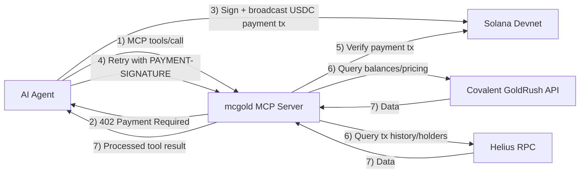

# 

# mcgold

Paid Solana intelligence tools for AI agents


- 🌐 Live demo: [Live demo](https://mcgold.vercel.app)
- 🔗 MCP server: [https://mcgold.onrender.com/mcp](https://mcgold.onrender.com/mcp) — *Note: first request may take 30–60s if the server has been idle (Render free tier cold start).*
- 📺 Demo video: *Coming with submission* (link will be added when the walkthrough is recorded)

## What Is This

mcgold is a paid MCP server on Solana that exposes three intelligence tools to AI agents: wallet risk scoring, whale activity tracing, and counterparty trust scoring. It pulls data from Covalent GoldRush and Helius, then returns structured analysis that agents can reason over directly. Each paid tool call settles in USDC on Solana devnet through x402, so usage is pay-per-call instead of subscription-based.

## Why This Exists

AI agents can reason about crypto workflows, but they still need reliable on-chain context to make decisions. Most existing APIs are designed for human-operated apps: account creation, API keys, monthly plans, and usage tiers managed off-chain. That model is a poor fit for autonomous agents that should discover tools and pay only when they need one result. mcgold closes that gap by combining MCP tool discovery with per-request USDC settlement on Solana. The result is an agent-native interface where a model can call a tool, pay, and continue its reasoning loop without a separate billing workflow.

## Architecture



The agent talks to `POST /mcp` using standard JSON-RPC methods such as `tools/list` and `tools/call`. Paid calls first return payment requirements, then the client signs and submits a USDC payment transaction on Solana devnet and retries with a `PAYMENT-SIGNATURE` header. The server verifies the on-chain payment, fetches source data from GoldRush and Helius, and returns normalized tool output. This keeps payments and data access in one request flow that agent runtimes can automate.

**Payments** settle on Solana **devnet** USDC; **data-plane** queries hit Solana **mainnet** (Helius mainnet RPC, plus GoldRush’s `solana-mainnet` APIs where available). This is **intentional for the hackathon** — it keeps test spend near zero while showcasing real on-chain analysis.

### Covalent GoldRush in production

Shipped tools call GoldRush **only** where it adds clear value:

- **`BalanceService.getTokenBalancesForWalletAddress`** — powers portfolio structure and USD marks in **`assess_wallet_risk`** and **`score_counterparty_trust`** (concentration, long-tail, dust, counterparty stability cues).
- **`PricingService.getTokenPrices`** — **`trace_whale_activity`** uses it for USD notionals on whale movements (7-day window; last quoted point as spot).
- **`BalanceService.getTokenHoldersV2ForTokenAddress`** (async iterator; we consume the **first** yielded page with `pageSize: 100`, `pageNumber: 0`) — **holder cross-check** vs Helius’s first-page unique-owner count when Covalent returns data.

**Limitations (honest):** `getTokenHoldersV2` **does not reliably serve `solana-mainnet` for many tokens** today — typical errors look like *`Chain: solana-mainnet is not currently supported for this endpoint`*. The tool **does not fail**: it sets **`goldrushHolderCount: null`**, **`holderSourcesAgree: null`**, **`holderSource: "helius_only"`**, and a one-line **`holderSourceReason`** explaining the gap. When both sources return counts, we compare and may set **`holder_source_disagreement`** if they differ by more than ~30%.

**Exploratory / future work:** [`src/test-goldrush.ts`](src/test-goldrush.ts) exercises additional surfaces (e.g. **`getHistoricalPortfolioForWalletAddress`**) to see what GoldRush returns per endpoint over time.

**Division of labor:** Helius is the **parsed-transaction** layer; GoldRush is the **structured balance and pricing** layer, plus **holder cross-check** when coverage allows.

### Payment path

- The server uses **`x402-solana`’s `X402PaymentHandler`** for the protocol flow: **`extractPayment`**, **`createPaymentRequirements`**, **`create402Response`**, **`verifyPayment`**, **`settlePayment`**, etc. ([`src/payment.ts`](src/payment.ts)).
- **`verifyPaymentOnChain`** queries Solana RPC (`getTransaction` + token delta checks) so we only accept a payment after the tx **landed on-chain**, even if the facilitator’s **`verifyPayment`** response is wrong or flaky.
- When the facilitator returns **HTTP 409** / **`duplicate_settlement`** (or settle otherwise reports duplicate / unexpected errors **after** on-chain verification already passed), we treat that as **non-fatal** and still complete the tool response.
- The **demo agent** uses **`createX402Client`** for the paid fetch path and **manual `/settle` posts** for some edge cases ([`src/demo-agent.ts`](src/demo-agent.ts)).

## The Three Tools

### `assess_wallet_risk`

One-line: Scores a Solana wallet from 0-100 using wallet age, concentration, transaction diversity, long-tail exposure, activity recency, and dust patterns.

Price: `$0.02 USDC` per call

Input schema:

```json
{
  "wallet": "string (base58 Solana wallet)"
}
```

Example response (truncated from demo run for `9sHdrUkpXAr4wQeKMh4RGKepDHX11RK5uZQoCmR5Y5zR`):

```json
{
  "score": 14,
  "tier": "low",
  "wallet": "9sHdrUkpXAr4wQeKMh4RGKepDHX11RK5uZQoCmR5Y5zR",
  "reasons": [
    { "factor": "walletAge", "weight": 20, "detail": "..." },
    { "factor": "concentration", "weight": 20, "detail": "..." },
    { "factor": "txDiversity", "weight": 15, "detail": "..." }
  ],
  "analyzedAt": "2026-.."
}
```

Good for: first-pass wallet due diligence before accepting transfers or routing funds.

### `trace_whale_activity`

One-line: Analyzes top-holder behavior for a token, including concentration metrics, notable whale movements, and risk flags.

Price: `$0.01 USDC` per call

Input schema:

```json
{
  "mint": "string (SPL mint base58)",
  "windowHours": "number 1-72 (optional, default 24)"
}
```

Example response (truncated, USDC mint `EPjFWdd5AufqSSqeM2qN1xzybapC8G4wEGGkZwyTDt1v`):

```json
{
  "mint": "EPjFWdd5AufqSSqeM2qN1xzybapC8G4wEGGkZwyTDt1v",
  "symbol": "USDC",
  "tokenUSDPrice": 1.0,
  "partial": false,
  "heliusHolderCount": 42,
  "goldrushHolderCount": 40,
  "holderSourcesAgree": true,
  "holderSource": "both",
  "holderSourceReason": "GoldRush and Helius first-page holder counts agree within ~30% (40 vs 42).",
  "dataQualityNotes": [],
  "topHolders": [
    { "wallet": "...", "balance": "...", "balanceUSD": 123456.78, "percentOfSupply": null }
  ],
  "notableMovements": [
    { "wallet": "...", "type": "transfer_out", "amountTokens": "...", "amountUSD": 5000, "txSignature": "..." }
  ],
  "concentration": { "top10HoldingPercent": null, "netFlowUSD": -5000, "distinctWhalesActive": 3 },
  "flags": ["top_holder_net_selling"]
}
```

Good for: monitoring token distribution and spotting holder-driven sell pressure or concentration risk.

### `score_counterparty_trust`

One-line: Scores transaction trust between two wallets using direct history, shared network overlap, behavior similarity, and counterparty stability.

Price: `$0.03 USDC` per call

Input schema:

```json
{
  "walletA": "string (your wallet)",
  "walletB": "string (counterparty wallet)",
  "lookbackDays": "number 1-365 (optional, default 90)"
}
```

Example response (truncated from demo run using wallet B `9sHdrUkpXAr4wQeKMh4RGKepDHX11RK5uZQoCmR5Y5zR`):

```json
{
  "walletA": "4dHc2cag4hmVeMFuFHF2Gjc4BoUiKFFMCTGfiWmyMsvx",
  "walletB": "9sHdrUkpXAr4wQeKMh4RGKepDHX11RK5uZQoCmR5Y5zR",
  "trustScore": 28,
  "tier": "caution",
  "interactionHistory": { "directTransactionsCount": 0, "firstInteractionAt": null, "lastInteractionAt": null, "totalDirectValueUSD": null },
  "redFlags": ["no_prior_interaction"],
  "positiveSignals": [],
  "reasons": [
    { "factor": "directHistory", "weight": 30, "detail": "..." }
  ],
  "analyzedAt": "2026-.."
}
```

Good for: deciding whether to proceed with a transfer when there is limited prior relationship context.

## Integration (How To Use It)

*Note: first request to `https://mcgold.onrender.com/mcp` may take 30–60s if the service was idle (**Render free tier cold start**).*

### Quick start with curl

Step 1: List tools (free)

```bash
curl -X POST https://mcgold.onrender.com/mcp \
  -H "Content-Type: application/json" \
  -H "Accept: application/json, text/event-stream" \
  -d '{"jsonrpc":"2.0","id":1,"method":"tools/list"}'
```

Step 2: Call a tool (returns payment requirement envelope)

```bash
curl -X POST https://mcgold.onrender.com/mcp \
  -H "Content-Type: application/json" \
  -H "Accept: application/json, text/event-stream" \
  -d '{
    "jsonrpc":"2.0",
    "id":2,
    "method":"tools/call",
    "params":{
      "name":"trace_whale_activity",
      "arguments":{"mint":"EPjFWdd5AufqSSqeM2qN1xzybapC8G4wEGGkZwyTDt1v","windowHours":24}
    }
  }'
```

Step 3: Pay and retry with `PAYMENT-SIGNATURE`

```bash
# Flow:
# 1) read PAYMENT-REQUIRED header (or MCP payment_required envelope)
# 2) sign + settle payment tx on devnet
# 3) retry same tools/call request with:
#    PAYMENT-SIGNATURE: <base64 x402 payload with tx signature>
#
# Full working reference:
# - src/test-x402-mcp-client.ts
# - src/demo-agent.ts
```

### Quick start with the MCP TypeScript SDK

```typescript
import { Client } from "@modelcontextprotocol/sdk/client/index.js";

const client = new Client({ name: "mcgold-example", version: "1.0.0" });
await client.connect(transport); // your Streamable HTTP transport

const tools = await client.request({ method: "tools/list" }, { timeout: 30_000 });
console.log(tools);

const result = await client.request(
  {
    method: "tools/call",
    params: {
      name: "assess_wallet_risk",
      arguments: { wallet: "9sHdrUkpXAr4wQeKMh4RGKepDHX11RK5uZQoCmR5Y5zR" }
    }
  },
  { timeout: 30_000 }
);
console.log(result);
```

For full payment orchestration, use the project references in [`src/test-x402-mcp-client.ts`](src/test-x402-mcp-client.ts) and [`src/demo-agent.ts`](src/demo-agent.ts).

## The Demo Agent

### An AI agent in action

[`src/demo-agent.ts`](src/demo-agent.ts) runs an end-to-end decision flow for the prompt: "Should I accept a transfer from this counterparty?" It uses Claude Sonnet 4.6 to choose tools, pays for each call in real USDC on devnet, reads the returned evidence, and produces a grounded recommendation.

```text
[AGENT] Starting counterparty trust analysis
[AGENT] My wallet:    4dHc2cag4hmVeMFuFHF2Gjc4BoUiKFFMCTGfiWmyMsvx
[AGENT] Alice wallet: 9sHdrUkpXAr4wQeKMh4RGKepDHX11RK5uZQoCmR5Y5zR

[PAY] Calling assess_wallet_risk
[PAY] Price: $0.02 USDC
[PAY] Payment confirmed: 2psxoniGxS3z...je9eyH
[TOOL] Risk score: 14/100 (low)

[PAY] Calling score_counterparty_trust
[PAY] Price: $0.03 USDC
[PAY] Payment confirmed: 4ZP18bsx...QQupb
[TOOL] Trust score: 28/100 (caution)

[CLAUDE] FINAL RECOMMENDATION: PROCEED_WITH_CAUTION

Total: $0.05 USDC across 2 tool calls
```

Sample payment transaction from this run: [explorer.solana.com/tx/2psxoniGxS3zZPnhuw8jxHC1E9CwDRV2NTR67LDaHyLHmGUWnvLT3TyoRAbiMdmyvWcky7UR5EhU6PMhS8je9eyH?cluster=devnet](https://explorer.solana.com/tx/2psxoniGxS3zZPnhuw8jxHC1E9CwDRV2NTR67LDaHyLHmGUWnvLT3TyoRAbiMdmyvWcky7UR5EhU6PMhS8je9eyH?cluster=devnet).

Run it yourself: `npx tsx src/demo-agent.ts` (requires `ANTHROPIC_API_KEY` and a funded devnet keypair — see Setup).

## Local Development

### Setup

Prerequisites:

- Node.js 20+
- Solana CLI
- Devnet SOL + devnet USDC
- Anthropic API key (for demo agent)

Install:

```bash
git clone https://github.com/Demiladepy/Mcgold.git
cd Mcgold
npm install
cp .env.example .env
```

Generate a devnet keypair, then fund it:

```bash
solana-keygen new --outfile ./mcpay-agent.json
```

- Fund SOL: [https://faucet.solana.com](https://faucet.solana.com)
- Fund devnet USDC: [https://faucet.circle.com](https://faucet.circle.com)

Set these in `.env`:

- `ANTHROPIC_API_KEY=...`
- `MCPAY_KEYPAIR_PATH=./mcpay-agent.json`
- `MCPAY_RECIPIENT_WALLET=<devnet pubkey>`

### Run the server locally

```bash
npx tsx src/index.ts
```

Server starts on port `3000` by default.

### Test the full flow

```bash
npx tsx src/test-x402-mcp-client.ts
```

Expected output pattern: `payment_required` / `402` -> pay on devnet -> retry with `PAYMENT-SIGNATURE` -> tool result returned, with on-chain USDC movement.

### Run the demo agent

```bash
npx tsx src/demo-agent.ts
```

Expected output: tool selection reasoning, per-call payment logs, and a final recommendation.

## Architecture Decisions

### Why these choices

#### Why MCP?

MCP gives agent runtimes a standard tool discovery and calling interface (`tools/list`, `tools/call`) without custom glue for each client. That keeps mcgold compatible with any MCP-capable runtime, not one specific app.

#### Why x402?

x402 keeps payments in the request/response loop instead of external account billing. Agents can handle payment requirements, sign, retry, and continue execution without API key management or subscription provisioning.

#### Why GoldRush?

GoldRush provides structured balance and pricing data that is directly useful for risk and concentration scoring. It reduces normalization work and gives a clean base layer for portfolio-centric analytics.

#### Why Helius?

Helius provides practical Solana transaction parsing and holder-level data that we need for movement and trust analysis. During development, GoldRush support for deep Solana transaction-history workflows was limited for our use case, so Helius fills that gap for parsed transaction and holder endpoints.

## Limitations & Future Work

### Current limitations

- Devnet only; no mainnet deployment yet.
- Render free tier can cold-start after idle (~30-60s); a keepalive monitor helps.
- Helius free-tier limits (around 8 request burst) require conservative call budgeting.
- `x402-solana` facilitator settle behavior required explicit client-side orchestration in this project; see [`src/test-x402-mcp-client.ts`](src/test-x402-mcp-client.ts).
- GoldRush **`getTokenHoldersV2ForTokenAddress`** on **`solana-mainnet`** is **incomplete for many tokens** (see `holderSource` / `holderSourceReason` on **`trace_whale_activity`** and [`src/test-goldrush.ts`](src/test-goldrush.ts)). Historical portfolio and other endpoints show similar coverage limits — see the test harness for current API behavior.

### Future work

- Mainnet deployment with USD-priced tools.
- Additional tools: token volatility scoring, contract risk assessment, social-graph counterparty scoring.
- Streaming variants of `trace_whale_activity` for real-time monitoring.
- Self-hostable facilitator option for teams that want to bypass PayAI-hosted settlement.

## Credits & Acknowledgements

- Built on Covalent GoldRush API.
- Powered by Helius RPC.
- Uses `x402-solana` by PayAI.
- Uses the MCP protocol by Anthropic.
- Submitted to Solana Frontier Hackathon 2026 (primarily Covalent track).
- Relevant accounts: `@goldrushdev`, `@SolanaColosseum`, `@SuperteamNG`.

## License

This project is licensed under the MIT License. See [`LICENSE`](LICENSE).
